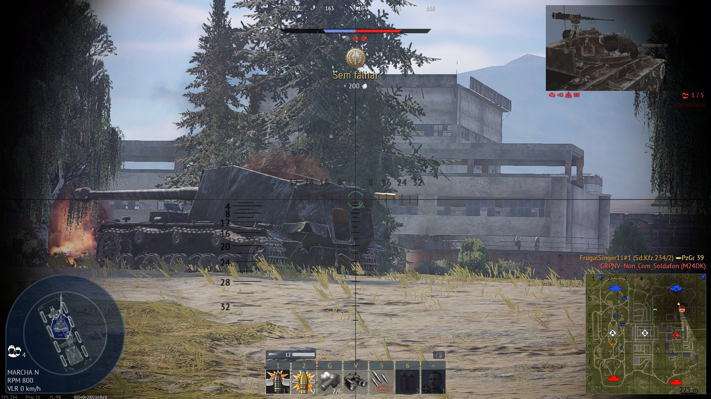
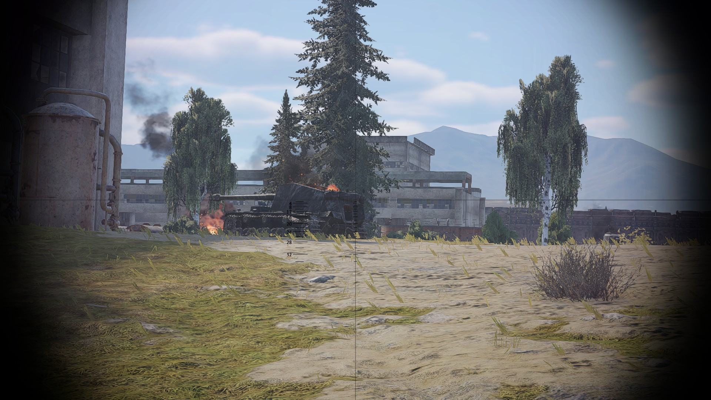

# BR-001 – Report: Destroyed tank shows projectile/impact model when zooming

- **Game:** War Thunder
- **Platform:** PC (Windows)
- **Mode:** Ground Battles (Realistic)
- **Camera:** Gun sight / Binoculars
- **Map:** [Domination #1] Test Site-2271
- **Your Vehicle:** Sd.Kfz.234/2
- **Build/Version:** 2.53.0.52

### **Description**

When observing a destroyed tank wreck, if the player zooms in using the gun sight or gets close enough while using binoculars/sight view, a projectile/impact object becomes visible on the wreck. It appears as if the shell that destroyed the vehicle is being rendered as a visible model/marker, which should not be displayed.

### **Steps to Reproduce**

1. Enter a Ground battle match.
2. Locate a destroyed tank wreck (burned out vehicle).
3. Aim at the wreck using **gun sight** or switch to **binoculars**.
4. Move closer to the wreck and/or zoom in.
5. Observe the wreck’s armor area where it was hit.

### **Expected Result**

Destroyed wrecks should not display visible projectile/shell models or “stuck shell” objects when zooming or changing camera distance.

### **Actual Result**

A projectile/impact model becomes visible on the destroyed tank wreck when zooming in or when the camera is close enough.

### **Repro Rate**

5/5 every time

### **Severity**

Minor (Visual)

### **Impact**

Visual artifact that may be distracting and can reveal hit location details on the wreck.

### **Attachments**

**Zoomed-in**

**Normal distance**

