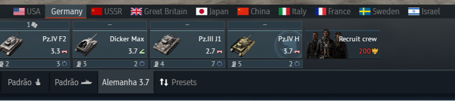

# BR-002 – Report: German flag icon does not display

- **Game:** War Thunder
- **Platform:** PC (Windows)
- **Mode:
- **Camera:**
- **Map:**
- **Your Vehicle:**
- **Build/Version:** 2.53.0.56

### **Description**

In the lobby/nation selection UI, the German flag icon does not display. Other nation flags display correctly.

### **Steps to Reproduce**

1. Launch War Thunder.
2. Go to the lobby / nation selection screen.
3. Select **Germany**.
4. Obeserve no Germany flag.

### **Expected Result**

The German flag icon should be visible in the menu, consistent with other nations.

### **Actual Result**

The German flag icon is missing / not rendered in the menu.

### **Repro Rate**

5/5 every time

### **Severity**

Minor (Visual/UI)

### **Impact**

Visual inconsistency in the UI; May confuse players when selecting nations.

### **Attachments**

**Lobby with no german flag**

