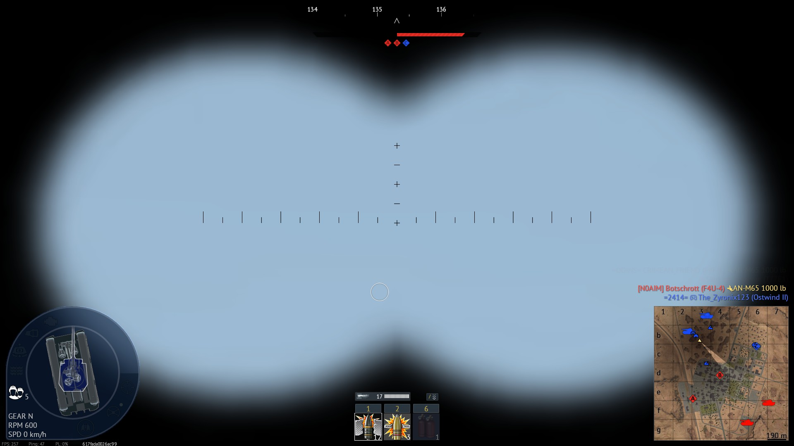
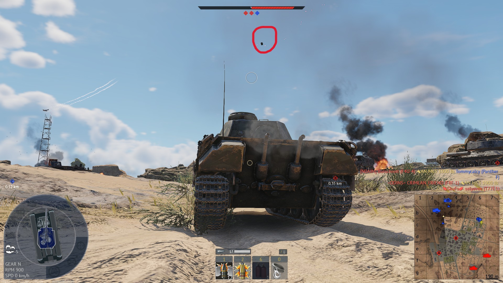

# BR-003 – Report: Floating object in the sky

- **Game:** War Thunder
- **Platform:** PC (Windows)
- **Mode:** Ground Battles (Realistic)
- **Camera:** Third-person / Free camera
- **Map:** [Domination #1] American Desert
- **Your Vehicle:** Panther D
- **Build/Version:** Approx. Build 21750353 (active on 04/02/2026 19:14 GMT)

### **Description**

A floating object, possibly a shell or debris, appears suspended in mid-air above the battlefield. The object remains static and does not interact with physics or gameplay elements.

### **Steps to Reproduce**

1. Enter a Ground battle match.
2. Move around the battlefield until a floating object appears in the sky.
3. Observe the object from different angles and distances using free camera.

### **Expected Result**

All projectiles, debris, or objects should follow realistic physics and fall or disappear naturally. No objects should remain floating in the air.

### **Actual Result**

A projectile/debris model remains floating in the sky, unaffected by gravity or game physics.

### **Repro Rate**

3/5

### **Severity**

Minor (Visual)

### **Impact**

Visual artifact that may be distracting and can reveal hit location details on the wreck.

### **Attachments**

**With Binoculars**

**Normal distance**

