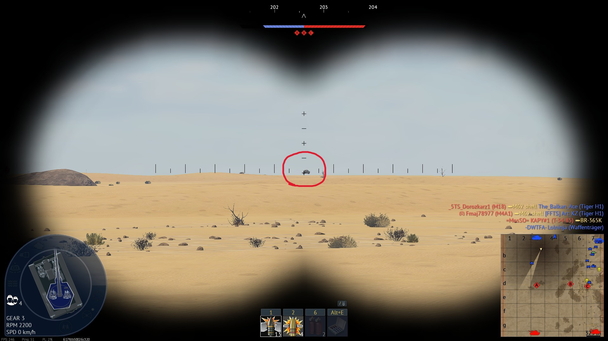

# BR-004 – Report: Enemy tank flying/levitating

- **Game:** War Thunder
- **Platform:** PC (Windows)
- **Mode:** Ground Battles (Realistic)
- **Camera:** Gun sight / Binoculars
- **Map:** [Domination #1] Sands of Sinai
- **Your Vehicle:** Waffenträger
- **Build/Version:** Approx. Build 21750353 (active on 04/02/2026 19:21GMT)

### **Description**

An enemy tank appears to be flying above the terrain instead of staying on the ground. The tank hover above the map, moving along their intended path but ignoring terrain constraints.

### **Steps to Reproduce**

1. Enter a Ground battle match.
2. Observe enemy tank movement.
3. Identify a tank that suddenly levitate above the terrain.
4. Track the tank using binocular camera.

### **Expected Result**

All tanks should remain grounded, interacting with terrain, obstacles and collisions properly.

### **Actual Result**

The Enemy tank appear floating above the terrain, defying physics and breaking immersion.

### **Repro Rate**

2/5

### **Severity**

Major (Gameplay/Immersion)

### **Impact**

* Breaks Visual and gameplay realism.
* May allow players to exploit positions or shooting angles.
* Confuses both friendly and enemy players regarding tank positioning.

### **Attachments**

**Enemy Floating**

